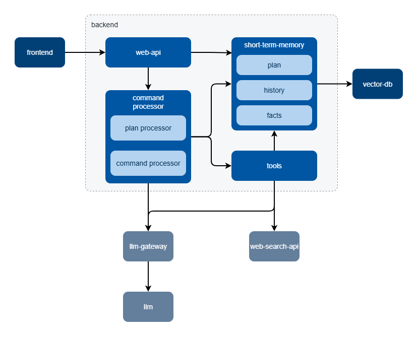
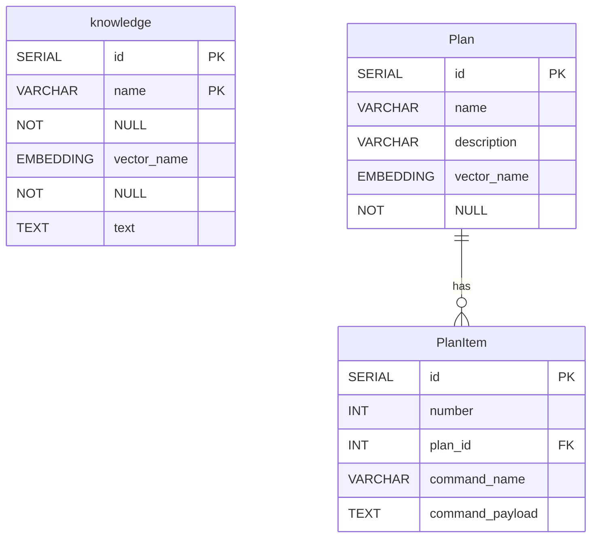
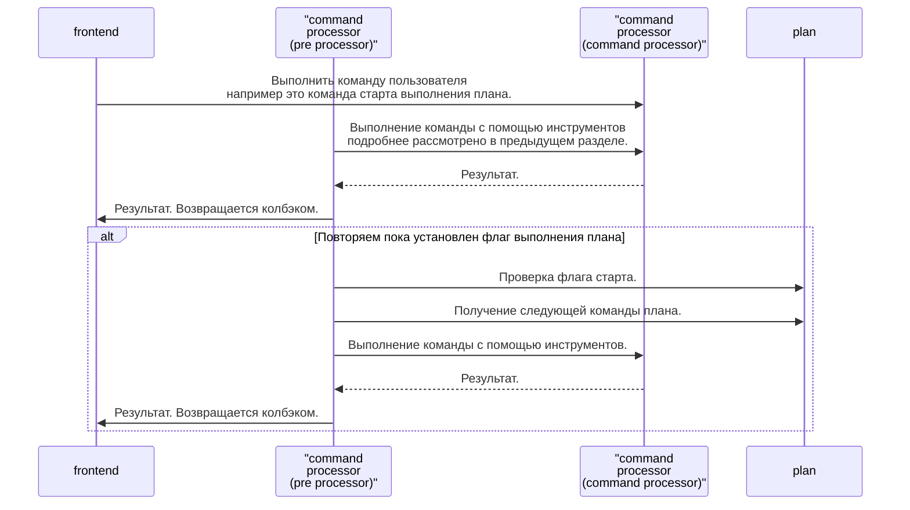
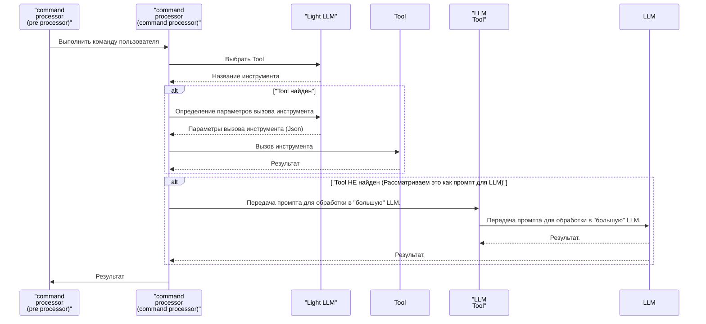

## Основные подходы к реализации системы

#### Структура системы (С4 L2)

 - **web-api** - API через которое осуществляется взаимодействие с агентом.
 - **command-processor** - основной компонент, обеспечивающий обработку сообщений пользователя.
 - **context** - временная память агента, состоящая из следующих блоков:
   * **history** - история диалога,
   * **knowledge** - набор поименованных фрагментов текста, которые можно использовать при инференсе,
   * **plan** - план действий, который агент должен выполнить.
- **tools** - Набор инструментов агента.

#### Инструменты

 - Инструменты для работы со локальными знаниями (knowledge); 
 - Инструменты для работы с базой знаний (общей БД);
 - Инструменты для работы с планом локально;
 - Инструменты для работы с БД планов;
 - Инструмент поиска в интернете;
 - Инструменты для работы с текстовыми файлами;
 - Инструмент для работы с LLM.

*Примечание: Использование LLM для инференса, осуществляется так же как вызов инструмента.*

**Ограничения:**

 - План действий составляется только пользователем. Это временное ограничение связанное со сжатыми сроками.

#### Использование паттерна React

Backend работает в рамках архитектурного паттерна **ReAct**.

 - Получает сообщение/команду пользователя;
 - Выбирает инструмент для обработки команды;
 - Подготавливает данные;
 - Вызывает инструмент.

Инструменты обеспечивают все взаимодействие агента с внешним миром.

#### Форматы взаимодействия с инструментами

Backend должен поддерживать два формата вызова инструмента (в перспективе три)

 - Произвольный текст, обрабатываемый LLM;
 - Команды "а-ля" скилл, формата / название команды : параметры в формате json;
 - В перспективе планируется Web UI для работы с планом и знаниями.

Для всех команд в истории (временная память) сохраняется как произвольный текст,
если он есть, так и параметры в формете json. Это позволяет легко пренеосить команды из истории
в план и поторно исполнять команды без траты токенов на их классификацию и обработку аргументов.

#### Постоянное хранение данных

В качестве векторного хранилища данных используется Postgres плагином **pgvector** (См. соответствующий ADR)

Структура хранения имеет следующий вид:

Ограничения: контекст агента между сессиями не сохраняется.

#### Выполнение плана

#### Обработка команды пользователя

Примечание: В процессе подготовки данных в тексте заменяются переменные (явные упоминания текстовых фрагментов из knowledge)
на сами фрагменты.