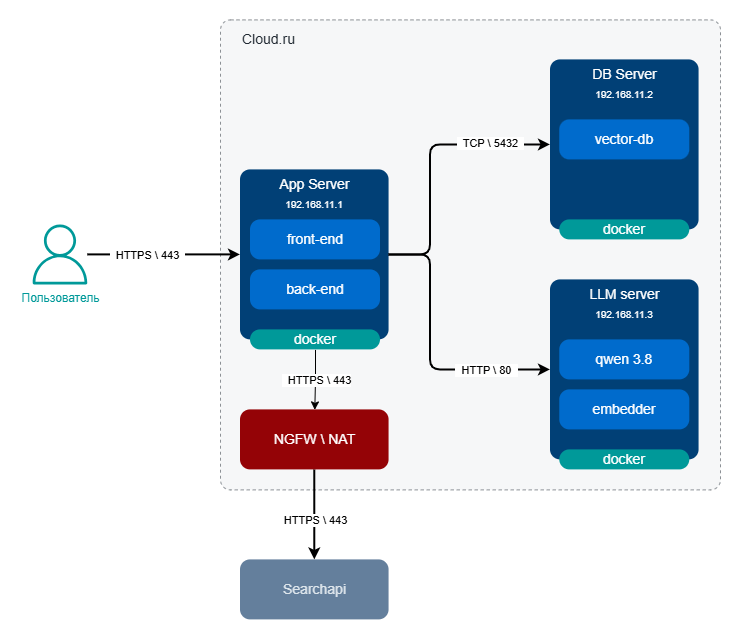

# Развертывание системы

## Диаграмма развертывания

## Рассчет сайзингов

#### App Server

CPU: 2  vCPU
RAM: 4GB
Disk: 40 GB SSD - system

#### DB Server

CPU: 2  vCPU
RAM: 32GB
Disk: 40 GB SSD - system
Disk: 100 GB SSD - data

#### LLM Server

CPU: 8 vCPU
GPU: A100 80GB
RAM: 64-128 GB
Disk: 40 GB SSD - system
Disk: 250 GB SSD - models 