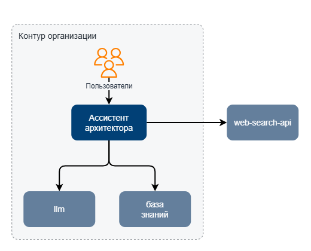

# ИИ-Ассистент архитектора : Постановка задачи
 
## Цель создания

* На 5% сократить трудозатраты на подготовку архитектурной документации
(подготовки ADR, актов принятия рисков и пр. документов) за счет автоматизации средствами ИИ.

## Общие требования

### Описание организации

Система внедряется в небольшой организации
(численность ИТ-персонала составляет до 100 человек)

* Архитектора (5 чел)
* Ведущие разработчики и аналитики (10 чел)
* Сотрудники подразделения кибербезопасности (5)

* Ожидаемый экономический эффект от внедрения составит: 320 т.р./мес

Количество одновременно работающих пользователей: 5

Количество отправляемых сообщений в час одним пользователем: 1200 - среднее

С учетом того, что при обработке запроса может происходить до трех обращений к ИИ,
имеем 3600 запросов в час, или 60 запросов в минуту.

Обращение к векторной БД происходит не каждый раз, а каждый пятый вызов (расчетное значение),
таким образом в среднем на векторную БД придется 12 обращений в минуту.

Ориентировочный объем знаний 300 000 чанков.

Инфраструктура организации развертывается в облаке (sbercloud.ru, advanced)

### Функциональные возможности

ИИ Ассистент, как и любой другой ИИ-агент должен обеспечивать выполнение следующих задач:

* Поиск в Интернете
* Поиск в Локальной Базе знаний
* Обработка найденной информации с помощью LLM
* Использование инструментов для работы с файловой системой (сохранение результатов).

Дополнительно ИИ Ассистент должен обеспечивать возможности:

* Ручного управления планами выполнения исследования (CRUD)
* Более атомарного управления контекстом 
(Просмотр\Редактирование\Удаление найденной информации в виде отдельных поименованных блоков)
* Сохранение планов и контекстов в базе знаний для последующего переиспользования.

Ограничения MVP-версии:
* Так как планируется реализовать систему, позволяющую обеспечить более полный контроль со стороны пользователя,
 самостоятельность агента в MVP-версии будет сильно ограничена.

### Ландшафт

## Прочие ограничения

* Доступ к системе должен осуществляться из контура Организации
* Так как обрабатываемая информация содержит данные по архитектуре АС,
возможно взаимодействие только с локально установленной LLM.
* В демо примере

